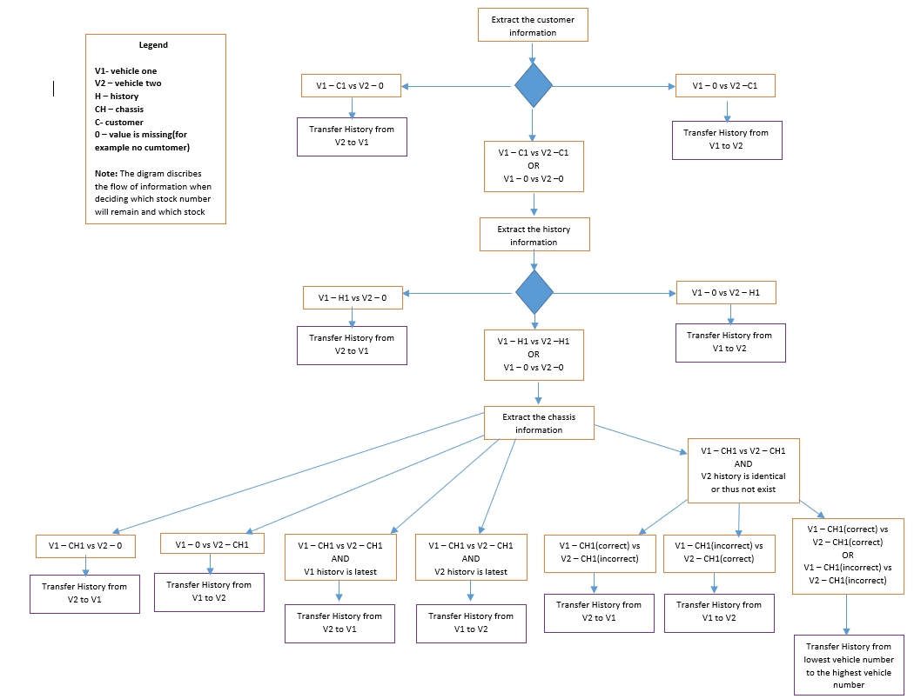
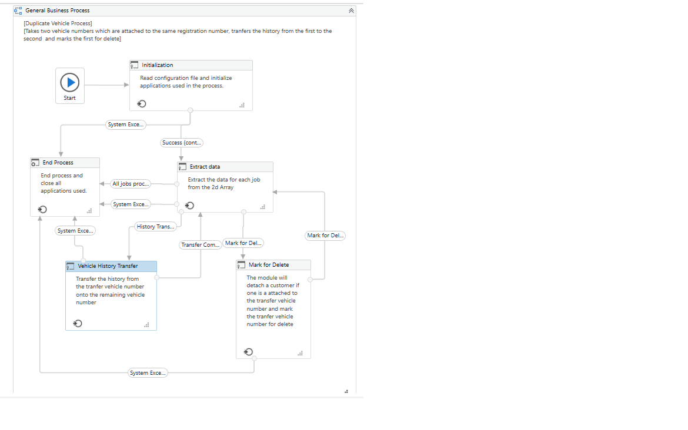

## Description

The scope of the project is to login as a regular user and using the same interface update the DBMS system to remove any duplicate records.

# Inputs

The process accepts a single string containing all the customer records and there specific information. During the execution the string is split into separate records and the DBMS is updated accordingly.

#Workflow implementation

The UiPath workflow is designed using state machines and each state represents a functional component of the process (for example: Initialization, Extract Data, Vehicle history Transfer). The workflow is also designed to adapt it's decisions based on the specific needs of a record.

# Software used to create the project

UiPath Studio

# Workflow Arguments

in_Vehicle_Number_list - this is the argument that takes in the string of information that needs to be processed

in_record_ID, in_view_ID - the process is meant to send an API call that will update information in a web application for which the record id and view id is required

# Outputs

The workflow will send an API call containing information of the records that have been successfully processed and the ones that have failed or if the process failed entirely.

# Data preparation

The string that is used as an argument is prepared in Integromat Scenario and sent as an API call to the UiPath orchestrator to schedule and start the process.
Please note that the logic by which the workflow decides the vehicle marked for delete is done in Integromat scenario following the bellow diagram:

# General Bussiness Process

